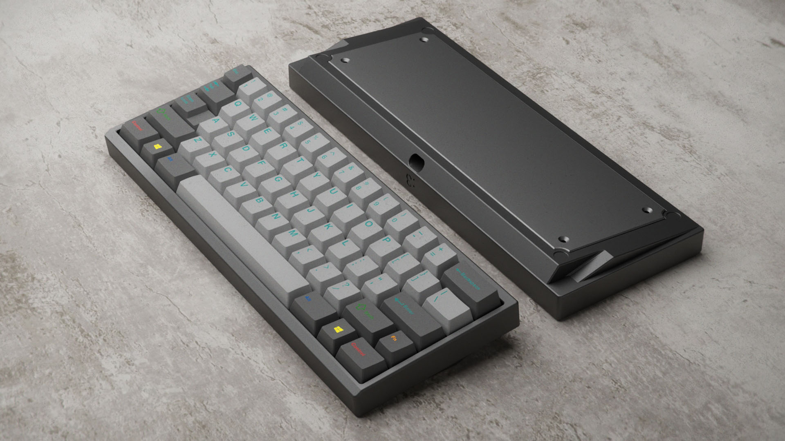
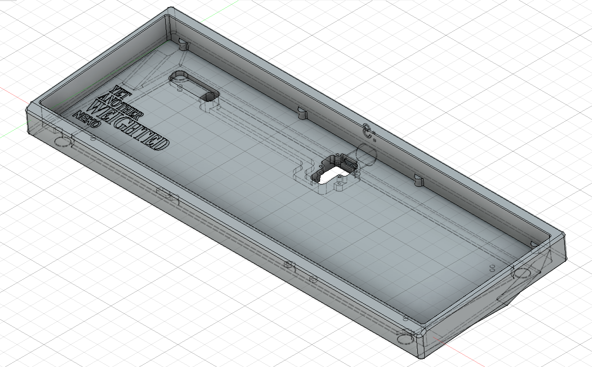
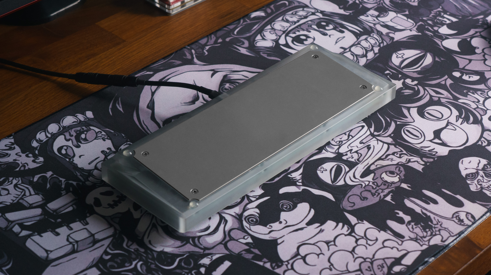
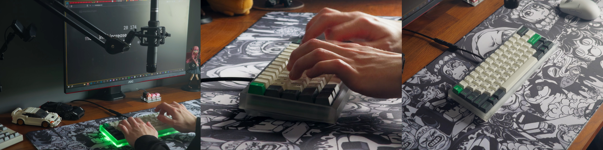

# YAWN60 (Yet Another Weighted bakeNeko)

An open-source 60% keyboard inspired by the Bakeneko, featuring a Unikorn-style weight, modified side profile, a cherry lip and some engravings.

## Specs

*   **Layout:** 60%
*   **Mounting Style:** O-Ring Gasket Mount
*   **Typing Angle:** 6-degree
*   **Overall Dimensions:** 295.70 x 111.66 x 29.78 mm (L x W x H)
*   **PCB Compatibility:** Designed for **[4pplet Waffling60](https://4pplet.com/products/waffling60-bakeneko-unikorn-kei-alternative-pcb-60-mx)**. May fit other Bakeneko/Unikorn-compatible PCBs, verify JST position.

## Features

*   Unikorn-inspired blank external weight.
*   Modified side profile.
*   25-degree cherry lip.
*   Moved JST hole to allow for Waffling60 use.
*   ":3" engraving near the USB-C port cutout.
*   "Yet Another Weighted Neko" internal engraving (Evangelion-style).

  

    
  </a>

## Required Hardware

| Part                 | Details                                                     | Link(s) / Source                                      |
| :------------------- | :---------------------------------------------------------- | :---------------------------------------------------- |
| Backplate Screws     | 4x M3x5mm Countersunk Head (0.5mm pitch)                    | Generic / Hardware Store                              |
| Daughterboard Screws | 4x M2x5mm Socket Head (Hex Drive, 0.4mm pitch)              | Generic / Hardware Store                              |
| Daughterboard (DB)   | Unified C3 DB (*4pplet version includes JST cable below*)   | [4pplet DB](https://4pplet.com/products/daughter-board-w-6-cable) |
| JST Cable            | 4-pin, 15cm, Reversed (*Included with 4pplet DB*)           | [AliExpress](https://www.aliexpress.com/item/1005003361828859.html) |
| O-Ring (Option 1)    | ID 212mm x 3.55mm CS (55A Hardness, Red)                         | [AliExpress](https://www.aliexpress.com/item/33011066688.html) |
| O-Ring (Option 2)    | Bakeneko 60 Size (60A Hardness, White)                      | [4pplet O-Ring](https://4pplet.com/products/60-o-ring) |
| Bumpons              | 8mm Diameter x 3mm Height (Self-adhesive)                   | [AliExpress Example](https://www.aliexpress.com/item/1005005615951861.html) |
| PCB                  | 60% compatible with JST hole (e.g., Waffling60)         | [4pplet Waffling60](https://4pplet.com/products/waffling60-bakeneko-unikorn-kei-alternative-pcb-60-mx) |

## Prototype

###   **Notes:** 
My unit was made with a **frosted polycarbonate case** and a **polished stainless steel weight**. These are not mandatory choices; the design allows for other  materials such as an anodized Aluminum 6063 case and/or a Brass weight.
  
###   **Real Pictures:**

  

  

  

  

  

  

## Sound Test

### <a href="https://youtu.be/5F3iMTc4hus"><u>Full video</u></a>

Please be aware that this test does not accurately reflect how it will actually sound. Keep in mind that the keyboard's overall acoustics are influenced by the case, plate, foam, lubing process, recording equipment, and tons of other external factors.

## Files Included

*   Case (`Files/YetAnotherCase.step`)
*   Backplate (Weight) (`Files/YetAnotherBackplate.step`)
*   Plate (`Files/YetAnotherPlate.dxf`). While standard universal 60% plates are compatible, a file is provided anyways.

## Notes & Disclaimers

*   This design is **untested** beyond the initial prototype shown. Use files at your own discretion.
*   Feel free to modify and use these files according to the license below.
*   If you build one, I'd love to see it! Tag me as @Microkeebs or reach out via microkeebs@gmail.com.

## License

 This work is licensed under a <a rel="license" href="http://creativecommons.org/licenses/by-nc-sa/4.0/">Creative Commons Attribution-NonCommercial-ShareAlike 4.0 International License</a>.

See the `LICENSE` file for the full license text.

